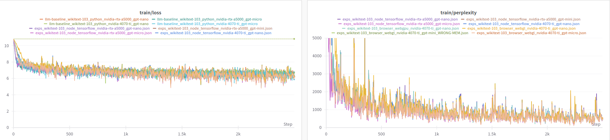
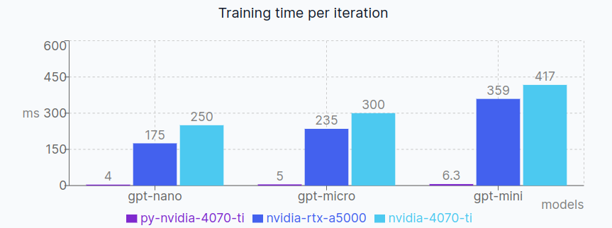
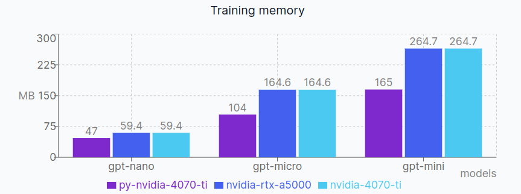
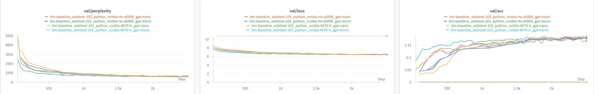
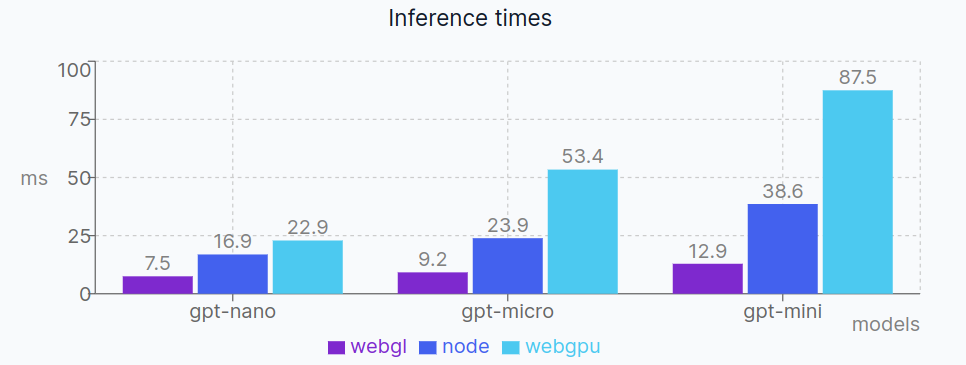

# File Structure

The important parts of the project are listed and explained below:

```sh
.
├── datasets # Folder containing the installed and preprocessed datasets
├── src
│   ├── browser # JS browser version
│   │   ├── client # NextJS client for training in the browser
│   │   │   ├── app # NextJS app router folder, defining pages and api routes
│   │   │   └── ml  # Folder containing the ML related scripts and tests, mostly just creates the web dataset and calls the core function
│   │   └── server # Express server for serving the client
│   │       └── socket.ts # WebSocket server for streaming the preprocessed dataset to the client
│   ├── gpt-tfjs # Clone of zemlyansky/gpt-tfjs repo, with modifications mostly for TS compatibility
│   ├── node # NodeJS version
│   │   └── train.ts # Training script calling the training function from core/train.ts
│   ├── pytorch # Pytorch version
│   │   ├── llm-baselines # Clone of the llm-baselines repo, with some minor modifications, mainly to use the config.py file
│   │   │   └── run.sh # Starts training with the config provided in src/core/config.json
│   │   └── minGPT # NOT USED: Clone of the minGPT repo, with some minor modifications, mainly to use the config.py file
|   |   |   └── run.sh # Starts training with the config provided in src/core/config.json
│   └── core # Core folder containing the shared scripts between the browser and node versions
│       ├── config.json # Main config file for picking the model and training parameters
│       ├── config.py # Importing the config.json file and exposing it to python apps
│       ├── config.ts # Importing the config.json file and exposing it to js/ts apps
│       ├── dataset-node.ts # Dataset implementation for Node, using the filesystem to stream read the dataset
│       ├── dataset.ts # Dataset implementation for the browser, transforming token arrays into a tf.data.Dataset
│       ├── evaluate.ts # Evaluation function for the model
│       ├── inference.ts # Inference function for the model
│       ├── preprocess.ts # Preprocessing script for the wikitext dataset (other datasets can be added)
│       └──  train.ts # Training function for the model, logging stats every iteration and saving them to WandB
├── chrome-webgpu.sh # Starts chrome with webgpu enabled
└── install-wikitext.sh # Installs the wikitext-103-raw dataset under ./datasets/
```

# Setup

Feel free to have a look at `./src/core/config.json` which is a file shared between the browser, node and python implementations. It is the main config file where you can change lots of parameters regarding the model, the training, and more.

# Installation & Setup

Everything has been tested under

-   Ubuntu 22.04.3 LTS (jammy)
-   kernel 6.5.0-1009-oem
-   Bun 1.0.22
-   Node v18.19.0 (npm v10.2.5)
-   Python 3.10.12

## Prerequisites

-   nvm = Node Version Manager: [install link](https://github.com/nvm-sh/nvm#installing-and-updating)
-   Bun = Fast runtime environment and package manager: [install link](https://github.com/oven-sh/bun)
-   if using wandb or test python implementation: python 3 and pip
-   cuDNN
    -   `sudo apt install nvidia-cudnn` OR see: [this stackoverflow link](https://stackoverflow.com/questions/66977227/could-not-load-dynamic-library-libcudnn-so-8-when-running-tensorflow-on-ubun)
    -   NOTE: the above command tried to uninstall some of my nvidia drivers, go to [this link](https://ubuntu.com/server/docs/nvidia-drivers-installation) for a guide on how to install the latest version

## Setup

```sh
$ pip install wandb # Install wandb package to export training stats to WandB
$ nvm install 18 # Set node version to 18.x
$ bun i -g node-gyp

$ git clone
$ cd disco-experiments/
$ ./install-wikitext.sh # Installs the wikitext-103-raw dataset

# Install core dependencies and run preprocessing
$ cd ./src/core/
$ bun install
$ bun preprocess.ts # Tokenizes the wikitext dataset as a preprocessing step

# Install gpt-tfjs dependencies
$ cd ../gpt-tfjs
$ bun install
```

## Running on the browser

Start the client:

```sh
$ cd ./src/browser/client/
$ bun install
$ bun run dev

# The following is optional and are destined to people who have chrome, run it in a new tab
$ google-chrome --enable-unsafe-webgpu --enable-features=Vulkan,UseSkiaRenderer # Run chrome with WebGPU enabled
# Or from the project root directory
$ ./chrome-webgpu.sh & # same command as above + run in detach mode
```

And now for the server:

```sh
$ cd ./src/browser/server/
$ bun install
$ bun run dev
```

1. **Important**: Check if your browser supports webgpu, firefox does not as of writing this and to the best of my knowledge. Go to [chrome://gpu](chrome://gpu) and there should be a flag under "Graphics Feature Status" called "WebGPU". Make sure it is set to **Enabled** or **Hardware Accelerated**. There is also a chrome flag ([chrome://flags](chrome://flags)) to enable Hardware Accelerated when available, this should be turned on as well.
2. Navigate to `localhost:3000` on your browser.
3. On the left, make sure the shown config is the one you want to use
4. Select the backend you wish to use, click on train, and check the console for logs.

## Running on Node

```sh
$ cd ./src/node/
$ bun install
$ bun train.ts {backendname} # run training, backendname=cpu|tensorflow|wasm, wasm does not work on my setup
```

## Running on Python (pytorch - llm-baselines)

```sh
cd ./src/pytorch/llm-baselines
python -m venv venv
source ./venv/bin/activate
pip install -r requirements.txt
python3 main.py --device=cuda:0
```

# Notes

-   CPU backend is way too slow because it is single threaded only (as far as I know). Multi threaded is possible using the WebAssembly backend but it does not work as of now. The backend is supported in the code and should work fine but a TFJS error is raised during training: `Uncaught (in promise) Error: Kernel 'UnsortedSegmentSum' not registered for backend 'wasm'`. From my understanding, some layers of GPT is not yet supported for this backend. The issue has been reported under: https://github.com/tensorflow/tfjs/issues/8082

## WandB

The pytorch tests work with wandb, but since the @wandb/sdk npm package is broken, the training statistics from **both** the browser and node versions are stored in a JSON file at the end of training and need to be exported to wandb manually. A script has been made for this:

```sh
$ cd ./src/gpt-tfjs/
$ python3 wandb-export.py wikitext-103 {platform} {backendname} {gpu} {model} # platform=browser|node, backendname=webgl|webgpu|cpu|tensorflow|wasm gpu=gpu name in config.json, model=gpt-nano|gpt-micro|...
```

# Fix errors & warnings

### Errors

-   "The Node.js native addon module (tfjs_binding.node) can not be found at path: /home/user/..."
    -   First move to the **appropriate directory** (watch the logs!), look at the error message and check the directory where the error is thrown, it might come from the `core` dir as well.
    -   Move to the directory mentioned in the error message
    -   `$ npm rebuild @tensorflow/tfjs-node --build-addon-from-source`
    -   `$ npm rebuild @tensorflow/tfjs-node-gpu --build-addon-from-source`

### Warnings

-   Missing cuda .so files
    -   sudo apt install nvidia-cuda-toolkit
-   To fix "successful NUMA node read from SysFS had negative value (-1)":
    -   for a in /sys/bus/pci/devices/\*; do echo 0 | sudo tee -a $a/numa_node; done
    -   (https://github.com/tensorflow/tensorflow/issues/42738)

# Results

Benchmarks are run for the gpt-nano, gpt-micro and gpt-mini models on an Nvidia 4070 Ti GPU and AMD Ryzen 5 7600 6-Core CPU. An Nvidia RTX A5000 is used for comparion.

## Training

Training done on the wikitext-103-raw dataset for 2500 steps.

<div align='center'>
    
    
    
</div>

#### Evaluation

<div align='center'>
    
</div>

## Inference

For inference, we consider the time in ms the model takes to predict the next token. An average is taken over 100 iterations of 3 independent runs.

<div align='center'>
    
</div>
